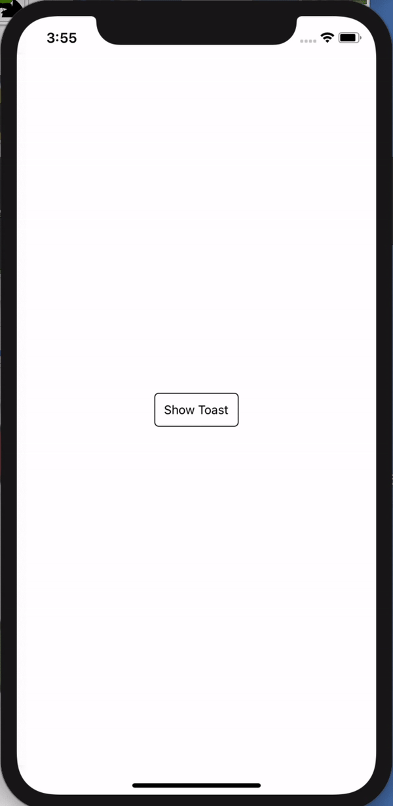

<h1 align="center">
  🚩 Toast
</h1>

<div align="center">

Toast Message in Multiple Lines

</div>

<p align="center" >
 <kbd>
    
  </kbd>
  <em>Toast example app.</em>
</p>

## Usage

**Note: You must be using React Native 0.60.0 or higher to use the most recent version of `@rabiloo/react-native-toast`.**

<br>

```bash
yarn add @rabiloo/react-native-toast
```

OR FROM GIT

```bash
yarn add https://github.com/rabiloo/react-native-toast.git
```

```jsx
- Step 1: Import Toast into your App.js file

import React from 'react';
import {Toast} from '@rabiloo/react-native-toast';

export default function App() {
  return (
    <View>
        <YourChild />
        <Toast />
    </View>
  );
}

```

```jsx
- Step 2: use ToastService to push a message
import {ToastService} from '@rabiloo/react-native-toast';

ToastService.set({message: 'Hello world', position: 'top'});

- position: String
  Position of the toast: 'top', 'bottom'. Default is bottom.
- message: String

```

## Properties for `<Toast />`

### `wrapperStyle?: object`

Style for toast wrapper component

---

### `style?: object`

Style for a toast item

---

### `textStyle?: object`

Style for Text

---

### `duration: number`

The duration for which a toast is displayed on screen

---

### `numberDisplay: number`

Number of toast is displayed on the screen

---

##

This simplifies the development and the testing of the project.

If you require new features or bug fixes for older versions you can fork this project.

## Licenses

MIT
